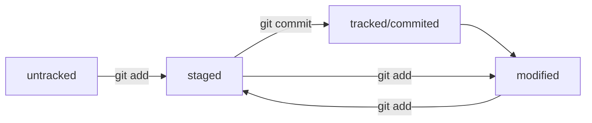

# *Привет друг! Это мой первый Readme!*  

## Я создал небольшой help по git:  

* ### Основные bach команды:  
 ---  
1. cd - переход в директорию, например в /home/my_folder - "cd /home/my_folder"  
2. mkdir - создание в директории  
3. rmdir -удаление директории  
4. rm -r - удаление рекурсивно  
5. touch test.txt - команда для создания файла test.txt  
6. ls - просмотр содержимого в директории  
7. ls -a - просмотр скрытого содержимого директории  
8. pwd - узнать в какой дириктории находимся  

* ### Основные команды в git:  
---  
1. git status - проверка статуса git репозиторий  
2. git add файл - добавление файла в локальный репозиторий git  
3. git commit -m 'commit 1' - коммит , т.е. запись изменения в репозитории  
4. git push - отправка коммитов удалённого с локальным  
5. git push -u origin master - первая отправка коммитов с удалённым репозиторием  
6. git remote -v  
7. git remote add origin git@github.com:Vladimir-Stepanenko/first-project.git - синхронизация с удалённым репозиторием  
8. ssh-keygen - утилита для создания ssh ключей  
9. git init - инициализировать дирикторию как Git репозиторий.  

* ### Хэш в git:  
---  

1. Хэш это информация о коммите, когда был сделан  
2. Состоит из 40 символов от 0-9 и латинские буквы A-F  
3. При изменение хотябы одного символа в исх.данных. хэш тоже измениться причём сильно.  

* ### Команда git log:  
---  

1. Выводит лог по всем коммитам  
2. Выводит дату создания каждого коммита  
3. Выводит автоора создания коммита и его mail  
4. выводит само сообщение коммита  
5. Команда git log --oneline выводит сокращённый лог всех коммитов одной строкой(часть хэша и комментарий)  

* ### Файл HEAD  
---  
- Файл в котором содержится ссылка на хэш коммита, сам файл лежит в папке .git  

* ### Информация о статусах файлов в git:  

1. Статус untracked - не отслеживаемый файл, который не добавлен в репозиторий git командой git add  
Так же у файла в таком статусе нет предыдущих версий.  

2. Статус tracked - отслеживаемый файл, который прошел git add, а также git commit  
Т.е файлы которые отчлеживает git  

3. Статус staged - файл подготовленный , файл с таким статусом становится после команды git add  

4. Статус modified - файл со статусом "измененный", означает что git сравнил содержимое файл с последней сохранённой версией  
и нашел отличия  

* #### небольшая схемка




## Более подробнее о Git можно узнать здесь - [информация о Git](https://github.com/git/git/blob/master/README.md)  

```By!``` ```valdemur95@yandex.ru``` ```Novosibirsk``` ```Devops``` ```Git```
